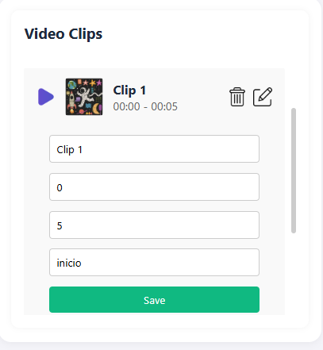
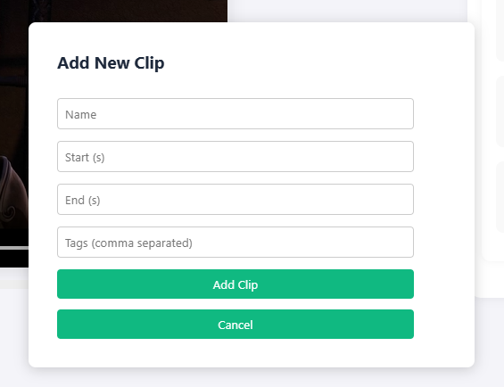

# 🎬 Video Clip Editor — React + Redux

This project is a **web application** built with **React**, **Redux Toolkit**, and **React Router** that allows users to upload and manage videos, create timestamped clips, and interact with a dynamic HTML5 video player.

> ✅ Built for a frontend technical challenge.
> 🧠 Demonstrates state management, component architecture, media fragments, and interactivity.

---

## 🚀 Features

### 📼 Core Functionality

- Upload and manage videos (.mp4)
- Create named **clips** with start/end times
- Edit and delete clips dynamically
- Display clips with:
  - Name
  - Duration (start–end)
  - Custom tags

### 🖥️ UI Capabilities

- HTML5 video player with:
  - **Media Fragments** to play specific sections
  - Auto-play next clip (with 3-second delay and loading spinner)
  - Timeline markers for each clip
- Search by clip name or tag
- Keyboard navigation:
  - `→`: next clip
  - `←`: previous clip

### 🧩 Bonus Features

- Clip search with live filtering
- Floating button to add clips (modal)
- Icon selection for video thumbnails
- Clip persistence in `localStorage`
- Fully responsive layout

---

## 🛠️ Tech Stack

| Tech            | Purpose                   |
| --------------- | ------------------------- |
| React           | Frontend UI framework     |
| Redux Toolkit   | Global state management   |
| React Router    | SPA route navigation      |
| HTML5 Video API | Embedded video control    |
| CSS             | Custom Responsive Styling |

---

## 🧾 Project Structure

```
src/
├── components/
│   ├── ClipForm.jsx
│   ├── ClipList.jsx
│   ├── ClipMarkers.jsx
│   ├── EditClipForm.jsx
│   ├── Navbar.jsx
│   ├── VideoLibrary.jsx
│   └── VideoPlayer.jsx
├── features/clips/
│   └── clipsSlice.js       # Redux slice for video/clip state
├── app/
│   └── store.js            # Redux store configuration
├── App.jsx                 # Main layout component
├── index.jsx               # Entry point (with routing)
├── index.css               # Full custom styling
```

---

## 📸 Screenshots


*Clip selection and editing with thumbnail and tags*


*Modal form to add new clips*

---

## 📦 Installation

```bash
# 1. Clone this repo
git clone https://github.com/CamiloAst/video-clips-app.git
cd video-clips

# 2. Install dependencies
npm install

# 3. Run in development
npm run dev
```

---

## 🧪 Testing Tips

- Use [this sample video](https://download.blender.org/durian/trailer/sintel_trailer-480p.mp4) for uploads
- Add clips using `start` and `end` in seconds
- Tags are separated by commas (e.g., `intro, action, slow-mo`)

---

## 📁 Persistence

- App uses `localStorage` to persist:
  - All uploaded videos
  - All created clips
  - Last selected video and clip

---

## 👤 Author

- [Juan Camilo Astudillo Olaya](https://github.com/CamiloAst) — Frontend Developer

---

## 📬 Contact

For questions or support, reach out to:

📧 J.KAMILO3020@gmail.com

---

## 📄 License

This project is provided as part of a frontend coding assessment and is open for educational use.
